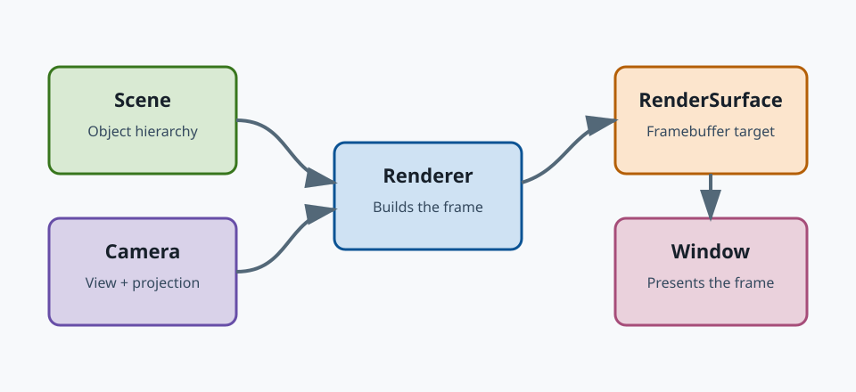
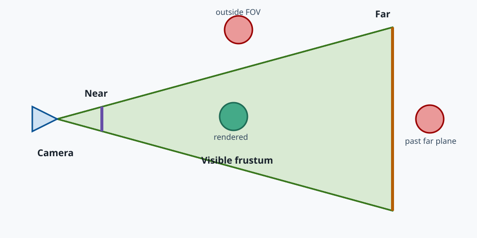
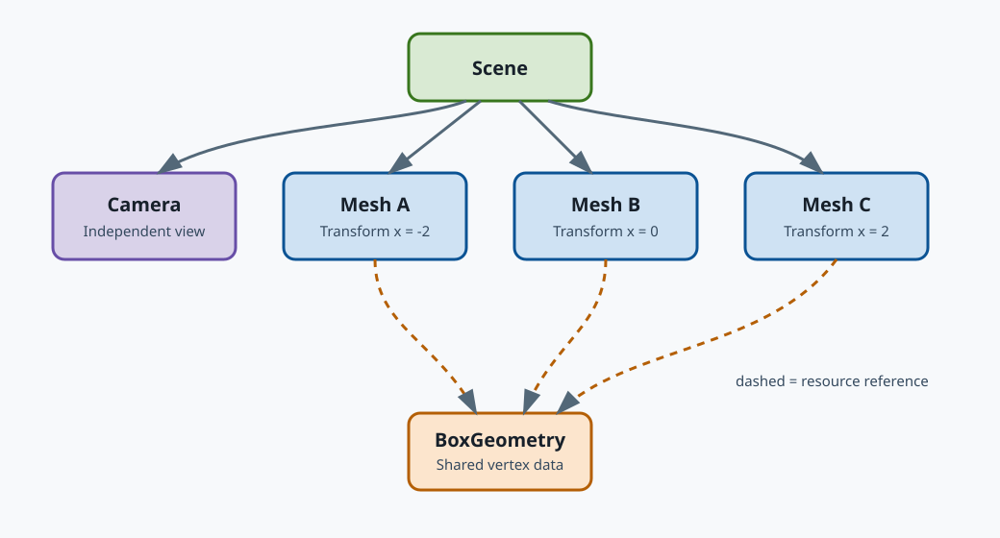

# Rendering fundamentals

JScene3D is a modular Java 3D engine. Its scene graph and renderable objects are
independent of a particular windowing backend, while `jscene3d-lwjgl` supplies
the native desktop window and OpenGL renderer used in this chapter.

This chapter builds the 3D equivalent of "Hello, world": one rotating cube.
Along the way it explains the relationships among the renderer, scene, camera,
geometry, material, mesh, light, and frame loop.

## The shape of a rendering application

A minimal application connects a `Scene` and `Camera` to a `Renderer`. The
renderer draws the part of the scene visible through the camera into a render
surface. A desktop `Window` supplies that surface and presents each completed
frame.



The important responsibilities are:

- `Window` owns the native desktop window and its OpenGL context.
- `Renderer` turns a scene and camera into pixels.
- `Scene` is the root of the renderer-level scene graph.
- `Camera` defines the viewpoint and projection.
- `Mesh` combines geometry, material, and a transform.
- `BufferGeometry` holds vertex and index data.
- `Material` describes how a surface is drawn.
- `Light` contributes illumination to light-reactive materials.

## Create the window and renderer

The window and renderer own native resources, so create them with
try-with-resources:

```java
try (Window window = Window.create("JScene3D - Hello Cube");
        Renderer renderer = Renderer.create(window)) {
    // Build and render the scene here.
}
```

`Window.create` initially creates a hidden window. This allows the application
to finish constructing its first frame before calling `window.show()`.

## Create the scene and camera

The scene is the root of the object hierarchy:

```java
Scene scene = new Scene();
scene.setBackground(Color.srgb(0x101820));
```

A perspective camera makes distant objects appear smaller. Its constructor
takes the vertical field of view in radians, the framebuffer aspect ratio, and
the near and far clipping distances:

```java
PerspectiveCamera camera = new PerspectiveCamera(
        PI_OVER_THREE,
        window.framebufferAspectRatio(),
        0.1f,
        100.0f);
camera.setPosition(0.0f, 0.0f, 3.0f);
```

The camera looks down its local negative Z axis. Moving it to positive Z places
the origin in front of it.

The field of view, aspect ratio, and clipping distances define a viewing
frustum. Objects outside this volume are not visible.



The near plane must be greater than zero. A very small near distance combined
with a very large far distance also reduces depth-buffer precision, so choose
the narrowest useful range.

## Build a mesh

A visible cube needs three things:

1. Geometry describing its vertices.
2. A material describing how those vertices are shaded.
3. A mesh carrying the geometry, material, and transform.

```java
BufferGeometry geometry = BoxGeometry.create(1.0f, 1.0f, 1.0f);
BasicMaterial material = new BasicMaterial(Color.srgb(0x44aa88));
Mesh cube = new Mesh(geometry, material);
scene.add(cube);
```

`BasicMaterial` does not respond to lights, which keeps the first example
small. The cube remains visible even though the scene has no light.

Geometry and materials are resources rather than object transforms. Several
meshes can share the same geometry or material while retaining independent
positions, rotations, and scales.



Moving or rotating a parent affects all of its descendants. This makes the
scene graph suitable for relationships such as a moon orbiting a planet or a
camera mounted on a vehicle. It does not make every resource a child: geometry,
materials, and textures are referenced by renderable objects and can be shared.

## Render and animate frames

A native application must poll platform events, update its state, render, and
present the result repeatedly:

```java
window.show();
long previousNanos = System.nanoTime();

while (!window.shouldClose()) {
    Window.pollEvents();

    if (window.framebufferSizeChanged()) {
        camera.setAspectRatio(window.framebufferAspectRatio());
    }

    long nowNanos = System.nanoTime();
    float elapsedSeconds =
            Math.max((nowNanos - previousNanos) / 1_000_000_000.0f, 0.0f);
    previousNanos = nowNanos;

    cube.rotateX(elapsedSeconds * 0.7f);
    cube.rotateY(elapsedSeconds * 1.1f);

    renderer.render(scene, camera);
    window.swapBuffers();
}
```

Rotation is based on elapsed time rather than frame count. The cube therefore
rotates at approximately the same speed on displays with different refresh
rates.

The camera aspect ratio is refreshed when the framebuffer size changes. Using
the framebuffer rather than only the logical window size also handles
high-density displays correctly.

## Complete example

The complete program is:

```java
package example;

import static io.github.glynch.jscene3d.math.Angles.PI_OVER_THREE;

import io.github.glynch.jscene3d.cameras.PerspectiveCamera;
import io.github.glynch.jscene3d.geometries.BoxGeometry;
import io.github.glynch.jscene3d.geometries.BufferGeometry;
import io.github.glynch.jscene3d.materials.BasicMaterial;
import io.github.glynch.jscene3d.math.Color;
import io.github.glynch.jscene3d.objects.Mesh;
import io.github.glynch.jscene3d.platform.Window;
import io.github.glynch.jscene3d.render.Renderer;
import io.github.glynch.jscene3d.scenes.Scene;

public final class HelloCube {
    private HelloCube() {
        throw new AssertionError("HelloCube cannot be instantiated");
    }

    public static void main(String[] arguments) {
        try (Window window = Window.create("JScene3D - Hello Cube");
                Renderer renderer = Renderer.create(window);
                BufferGeometry geometry = BoxGeometry.create(1.0f, 1.0f, 1.0f);
                BasicMaterial material = new BasicMaterial(Color.srgb(0x44aa88))) {
            Scene scene = new Scene();
            scene.setBackground(Color.srgb(0x101820));

            Mesh cube = new Mesh(geometry, material);
            scene.add(cube);

            PerspectiveCamera camera = new PerspectiveCamera(
                    PI_OVER_THREE,
                    window.framebufferAspectRatio(),
                    0.1f,
                    100.0f);
            camera.setPosition(0.0f, 0.0f, 3.0f);

            window.show();
            long previousNanos = System.nanoTime();
            while (!window.shouldClose()) {
                Window.pollEvents();
                if (window.framebufferSizeChanged()) {
                    camera.setAspectRatio(window.framebufferAspectRatio());
                }

                long nowNanos = System.nanoTime();
                float elapsedSeconds = Math.max(
                        (nowNanos - previousNanos) / 1_000_000_000.0f,
                        0.0f);
                previousNanos = nowNanos;
                cube.rotateX(elapsedSeconds * 0.7f);
                cube.rotateY(elapsedSeconds * 1.1f);

                renderer.render(scene, camera);
                window.swapBuffers();
            }
        }
    }
}
```

Within this repository, run the existing rotating cube example with:

```shell
./tools/scripts/run-example.sh TexturedCubeExample
```

The example framework supplies the same window, renderer, frame-loop, resize,
and resource-lifecycle responsibilities shown explicitly above.

## Add lighting

Replace the unlit `BasicMaterial` with a `LambertMaterial`, then add ambient and
directional light to the scene:

```java
LambertMaterial material = new LambertMaterial(Color.srgb(0x44aa88));

scene.add(new AmbientLight(Color.WHITE, 0.2f));
DirectionalLight keyLight = new DirectionalLight(Color.WHITE, 1.5f);
keyLight.setPosition(2.0f, 3.0f, 4.0f);
scene.add(keyLight);
```

Light-reactive materials need both surface normals and illumination.
`BoxGeometry` supplies normals, so changing the material and adding the lights
is sufficient here. `BasicMaterial` deliberately ignores those lights.

Run the broader lighting example with:

```shell
./tools/scripts/run-example.sh LightingExample
```

## Where the project model begins

Everything in this chapter uses the renderer-level object model directly. It is
appropriate for focused visualizations, tools, demonstrations, and rendering
code inside a larger application.

A complete editable game should not hard-code its entire world as a renderer
scene. JScene3D's project model adds authored assets, reusable entity
definitions, component descriptors, runtime behavior, and editor-safe loading.
Continue with [Project and game fundamentals](project-fundamentals.md) before
building an editable game.
