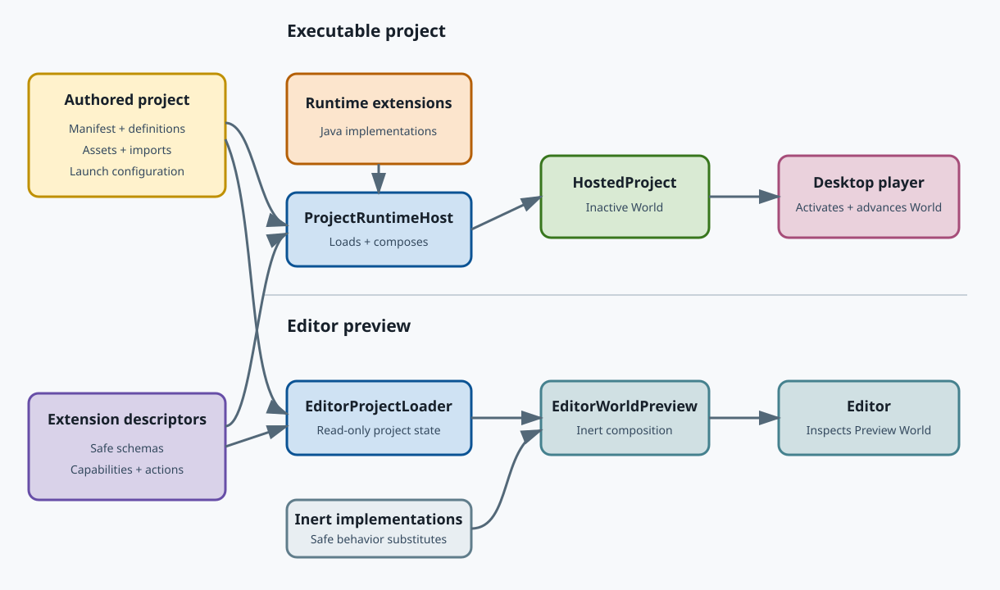

# Project and game fundamentals

The rendering API answers, "What should be drawn?" A game project must also
answer what exists, what can change, how behavior is connected, which assets
are authored, and how the editor can inspect content without knowing every
game's Java classes in advance.

JScene3D addresses those concerns with a hierarchical entity-component world
model above the renderer scene graph.

## Two related object models

The distinction between these pairs is fundamental:

| Rendering concept | Project and game concept |
| --- | --- |
| `Scene` | `World` |
| `Object3D` | `Entity` with a spatial component |
| `Mesh` | Rendering component attached to an entity |
| Direct Java construction | `WorldDefinition` and `EntityDefinition` assets |
| Renderer frame | Scheduled world behavior followed by presentation |

A `Scene` is the root of the objects needed to draw an image. A `World` owns
live entities, behavior, physics, audio, presentation modules, and runtime
resources. A world can therefore produce a renderer scene, but the two terms
are not interchangeable.

## From files to a running world

The principal stages are:

1. A project manifest identifies the project, startup world, extensions,
   assets, and launch presentation.
2. Extension descriptors declare component types and their schemas without
   requiring the editor to load application implementation classes.
3. Import definitions publish source data into stable project assets.
4. A `WorldDefinition` describes root entities and reusable definition
   placements.
5. For execution, `ProjectRuntimeHost` loads runtime extensions, validates the
   project, and composes a `HostedProject` containing an inactive `World`.
6. The desktop player activates that world, then its runtime modules update
   behavior and present through rendering, audio, physics, and UI services.
7. The editor instead uses `EditorProjectLoader` to create read-only editor
   state and `EditorWorldPreview` to compose a separate world with inert
   behavior and safe presentation implementations.

## Entities and components

There is one runtime `Entity` type. An entity intrinsically owns identity,
enabled state, components, child entities, and lifecycle. Rendering, physics,
audio, animation, and game rules are supplied by components rather than entity
subclasses.

Use a component when a capability shares the entity's identity, transform, and
lifetime. Use a child entity when something needs an independent transform,
identity, lifecycle, component set, or reusable definition.

The hierarchy expresses ownership. Spatial inheritance is provided through a
compatible spatial component such as `Transform3d`; it is not an unconditional
property of every entity.

## Definitions are authored; worlds are live

An `EntityDefinition` is an immutable, reusable, single-root entity hierarchy.
Placing the same definition several times creates independent live entities
that share authored intent rather than mutable runtime state.

A `WorldDefinition` contains world settings and any number of root entries. A
root entry may be authored directly in that world or may place an
`EntityDefinition`.

Loading a definition does not execute it. Instantiating or spawning it creates
live entities. This separation lets the editor inspect and validate authored
content without starting the game.

## Descriptors and runtime implementations

A component descriptor supplies stable, editor-readable metadata:

- a namespaced component type and schema version;
- typed properties with defaults and constraints;
- provided and required capabilities;
- signals and actions;
- spatial and scheduling participation;
- the seam used to locate its runtime implementation.

Serialized project data refers to those stable identifiers, never to a Java
implementation class name. The editor therefore needs the descriptor metadata
for a game extension, not every possible game's implementation classes on its
own classpath.

When an application runs, a runtime extension registers the Java factories and
services that implement its descriptors. Doomed Corridors can consequently own
specialized enemy, weapon, door, floor, HUD, and menu behavior without adding
those concepts to the general JScene3D engine or editor.

## Capabilities connect components

Components depend on semantic capabilities rather than concrete sibling
classes. A transform component can provide a spatial capability, while a mesh
renderer or collider requires it. The composer validates these relationships
before the world becomes active.

Capabilities preserve composition while avoiding a global service locator and
avoiding direct knowledge of project-specific implementation classes.

## Loading, previewing, and playing

The desktop player and editor consume the same authored project but use it for
different purposes:

- The desktop player loads runtime implementations, activates behavior, accepts
  input, and advances the world.
- The editor loads safe descriptors and authored assets, then composes an inert
  presentation preview without executing application behavior.

This is why a Doomed Corridors map can appear in the editor even though the
editor itself does not contain `DoomPlayerState`, `DoomDoorInteractor`, or any
other title-specific component class.

## Launch requests and playtest profiles

A `ProjectLaunchRequest` describes the intent for one load operation. A normal
request uses the project's standard entry world and parameters. A playtest
request may select a named profile, choose a particular world, or supply local
overrides such as a test spawn or invulnerability.

A `PlaytestProfile` is a reusable development preset. It is configuration from
which a launch request can be constructed; it is not part of normal public game
state. A future editor "Play from here" action can construct the same kind of
request using its current world and camera position.

## Deciding where code belongs

When introducing a feature, ask which layer owns the concept:

- Put general rendering objects and algorithms in the renderer or core
  modules.
- Put genre-independent game facilities in `jscene3d-game`.
- Put project loading, descriptors, composition, and editor-safe metadata in
  the project modules.
- Put title-specific rules and component implementations in the game
  application or its extension.
- Put content choices, configured properties, and placements in authored
  project assets.

This keeps the editor extensible and prevents the first game from defining the
engine around one genre.

For the complete contract, continue with the
[entity-component world architecture](../design/entity-component-world-architecture.md).
