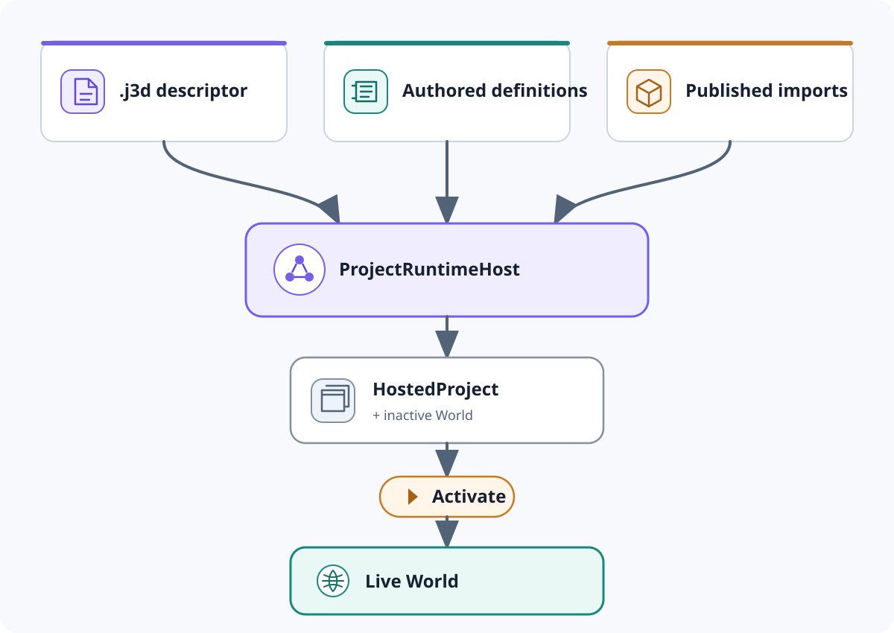

# Project and game fundamentals

The rendering API answers, "What should be drawn?" A game project must also
answer what exists, what can change, how behavior is connected, which assets
are authored, and how the editor can inspect content without knowing every
game's Java classes in advance.

JScene3D addresses those concerns with a hierarchical entity-component world
model above the renderer scene graph.

## Two related object models

The distinction between these pairs is fundamental:

| Rendering concept | Project and game concept |
| --- | --- |
| `Scene` | `World` |
| `Object3D` | `Entity` with a `Transform3d` component |
| `Mesh` | Rendering component attached to an entity |
| Direct Java construction | `WorldDefinition` and `EntityDefinition` assets |
| Renderer frame loop | World lifecycle, fixed simulation, and frame updates |

A `Scene` is the root of the objects needed to draw an image. A `World` owns
the live entity hierarchy, component values, runtime resources, and host-supplied
world modules. Spatial and presentation components can drive renderer objects,
but a `World` is not a `Scene`, and an `Entity` is not an `Object3D`.

## From files to a running world



The principal stages are:

1. The project-named `.j3d` descriptor identifies the project, engine
   compatibility, entry and optional startup worlds, input map, extensions,
   source assets, imports, and launch presentation.
2. `ProjectLoader` locates and validates that descriptor as a `GameProject`
   without loading executable extensions or running import providers.
3. Extension descriptors provide safe type and component metadata. The asset
   catalog identifies authored definitions, while the selected runtime
   environment combines them with generated definitions and resources from
   previously published imports.
4. `ProjectRuntimeHost` discovers trusted runtime extensions, creates
   host-selected world modules, and asks `WorldComposer` to compose the chosen
   `WorldDefinition`.
5. Successful composition returns a `HostedProject` containing project
   metadata, its asset catalog, the launch request, and an inactive `World`.
6. The manifest-selected application runtime extension may prepare that
   project before the desktop runner activates and advances the world.

Importing and execution remain separate. Import tools can run format-specific
providers and atomically publish generated definitions or resources. Runtime
loading reads those published generations without rediscovering or executing
the import providers.

## Entities and components

There is one runtime `Entity` interface rather than a hierarchy of
game-specific entity subclasses. Each live entity has stable authored and
runtime identity, enabled state, components, owned children, and an owning
`World`. Rendering, physics, audio, animation, and game rules are supplied by
components.

Use a component when a capability shares the entity's identity, transform, and
lifetime. Use a child entity when something needs an independent transform,
identity, lifecycle, component set, or reusable definition.

The hierarchy expresses ownership. Spatial inheritance is provided by a
compatible component such as `Transform3d`; it is not an unconditional
property of every entity.

## Definitions are authored; worlds are live

`WorldDefinition` and `EntityDefinition` are immutable authored data. `World`
and `Entity` are live runtime state.

An `EntityDefinition` is a reusable, single-root entity hierarchy with an
optional exported contract and internal signal/action connections. Placing the
same definition several times creates independent live entities that share
authored intent rather than mutable runtime state.

A `WorldDefinition` has a stable identity, display name, internal connections,
and any number of root entries. A root entry may be a locally authored entity
or a placement of an `EntityDefinition`.

Loading a definition does not execute it. Composition constructs an inactive
world and its component values; activation begins lifecycle participation.
Spawning a prepared entity definition creates additional live entities. This
separation lets authoring tools inspect and validate definitions without
starting the game.

## Descriptors and runtime implementations

An `ExtensionDescriptor` is inert metadata for an extension's registered
types, components, and project settings. A component descriptor supplies:

- a namespaced component type and configuration version;
- typed properties with defaults and constraints;
- signals, actions, and provided or required capabilities;
- multiplicity, conflicts, and spatial attachments;
- spatial, lifecycle, and deterministic update participation.

Serialized project data refers to those stable identifiers, never to a Java
implementation class name. Authoring tools therefore need the descriptor
metadata for an extension, not the extension's executable implementation
classes.

When an application runs, a `ComponentRuntimeExtension` with the same stable
extension identity registers the trusted Java factories that implement those
descriptors. The application extension selected by the project descriptor can
also prepare the composed project before activation. Doomed Corridors can
consequently own specialized enemy, weapon, door, floor, HUD, and menu behavior
without adding those concepts to the general JScene3D engine or editor.

## Capabilities connect components

Components depend on semantic capabilities rather than concrete sibling
classes. A transform component can provide a spatial capability, while a mesh
renderer or collider requires it. A required capability resolves to exactly
one provider on the same entity, and the composer validates these relationships
before publishing the inactive world.

Capabilities preserve composition while avoiding a global service locator and
avoiding direct knowledge of project-specific implementation classes.

## Authoring stays separate from runtime

The current editor boundary is:

```text
Code OSS frontend
        ↓ authoring protocol
Java authoring service
        ↓
EditorProjectLoader / EditorProjectSession
```

The frontend delegates project and definition semantics to the persistent,
headless Java authoring service. `EditorProjectLoader` loads the `.j3d`
descriptor, project settings, safe extension descriptors, authored assets,
import definitions, and already-published generated content. It does not load
runtime extensions, execute arbitrary game implementation code, or construct
an active runtime `World`.

An `EditorProjectSession` exposes project metadata, diagnostics, hierarchy and
Inspector projections, and authoritative state for retained definitions.
Authored definitions use source-preserving working copies whose edits and
validation remain owned by Java. Generated definitions are retained as
read-only content. The Code OSS frontend presents this state and sends semantic
authoring requests; it does not reimplement the project model.

Runtime execution follows the separate `ProjectRuntimeHost` path, where trusted
runtime extensions are loaded and a live world is composed and activated.

This is why a Doomed Corridors map can appear in the editor even though the
editor itself does not contain `DoomPlayerState`, `DoomDoorInteractor`, or any
other title-specific component class.

## Desktop launches and playtest profiles

A `ProjectLaunchRequest` selects the world and portable parameters for one
runtime load. A standard request lets the descriptor choose the startup or
entry world. A playtest request records a named profile, a project-relative
world-definition path, and application-defined parameters.

A `PlaytestProfile` is a reusable local-development preset loaded from
`playtest/profiles.json`; it is not exported project state. The desktop launcher
currently resolves an optionally selected profile into a `ProjectLaunchRequest`
before asking `ProjectRuntimeHost` to load the project.

## Deciding where code belongs

When introducing a feature, ask which layer owns the concept:

- Put general rendering objects and algorithms in the renderer or core
  modules.
- Put genre-independent game facilities in `jscene3d-game`.
- Put descriptors, authored data, imports, and runtime composition in the
  focused project modules.
- Put authoritative authoring semantics in the headless Java authoring layer
  and editor presentation and interaction in the Code OSS frontend.
- Put title-specific rules and component implementations in the game
  application or its extension.
- Put content choices, configured properties, and placements in authored
  project assets.

This keeps the editor extensible and prevents the first game from defining the
engine around one genre.

For the complete contract, continue with the
[entity-component world architecture](../design/entity-component-world-architecture.md).
